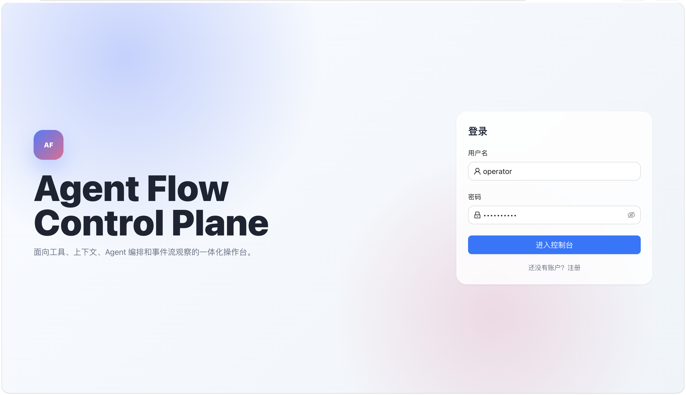
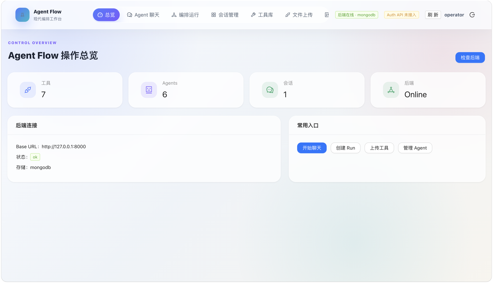
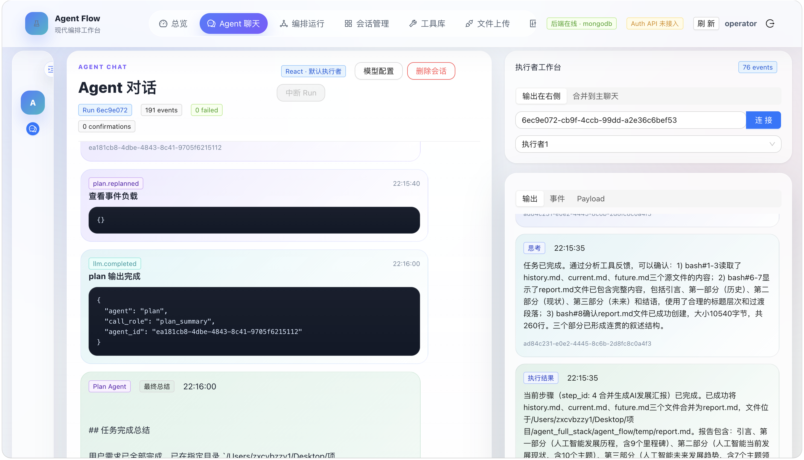
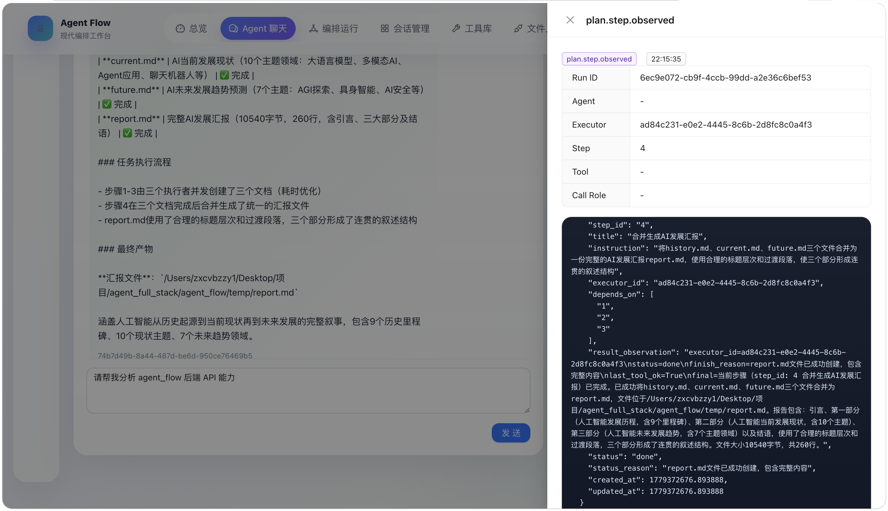
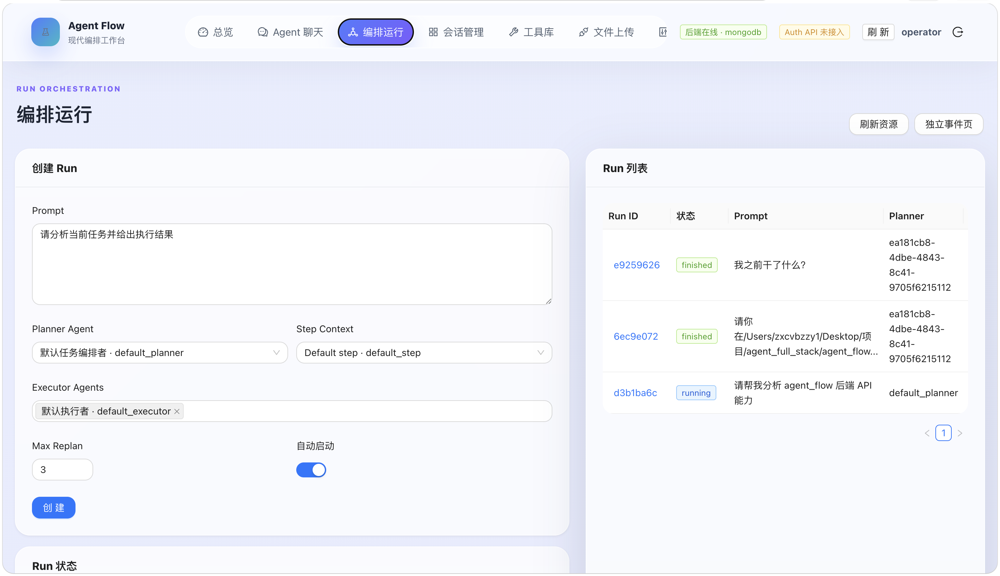
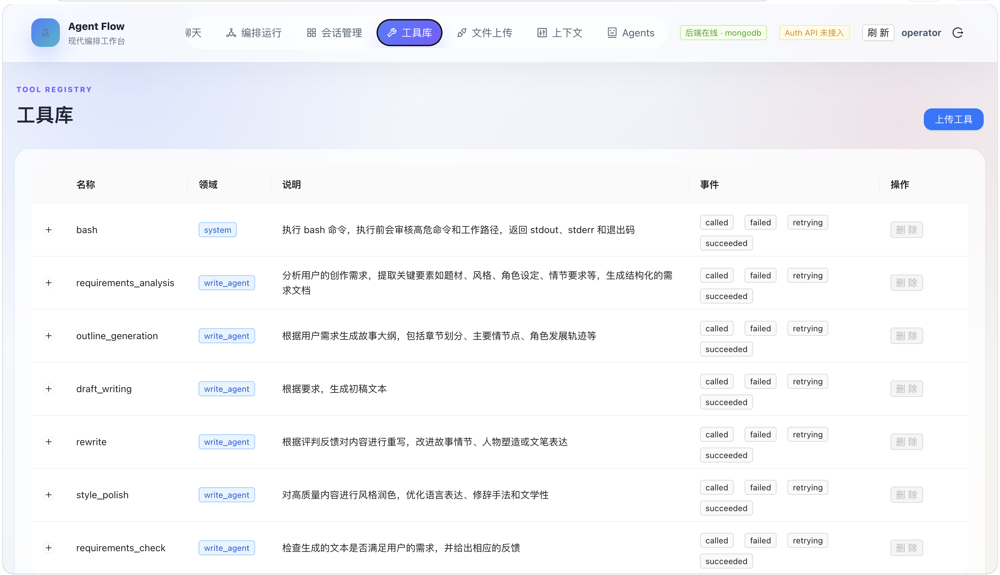
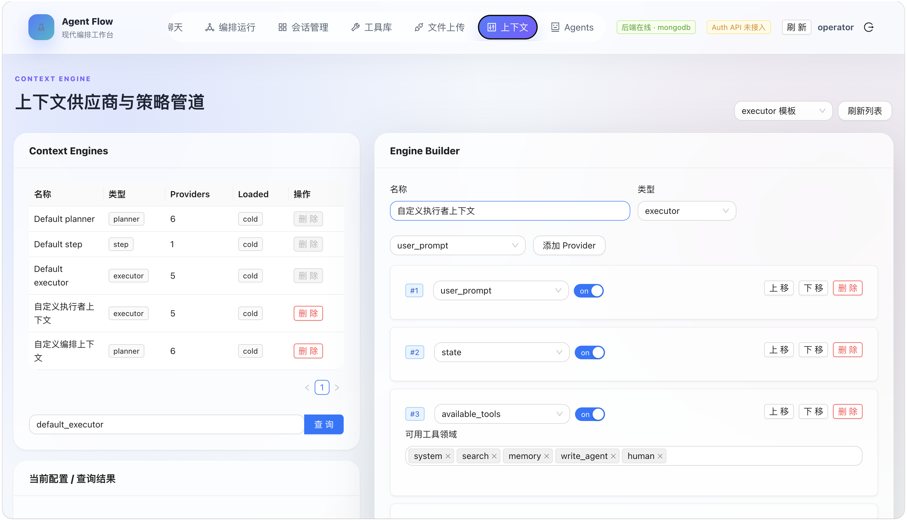
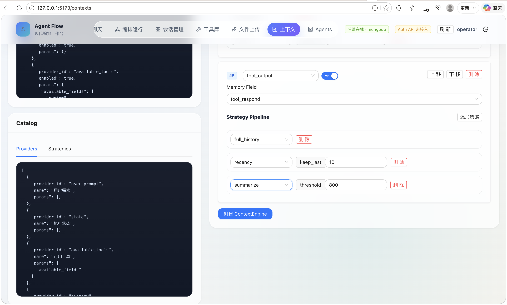
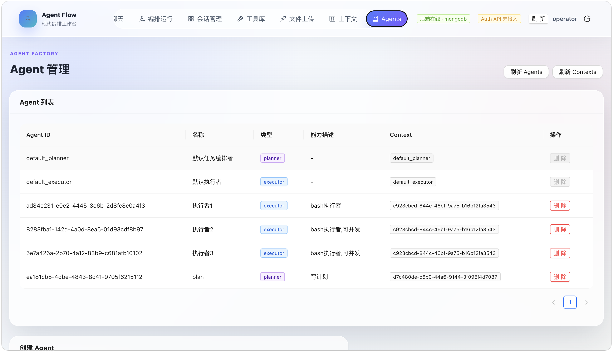

# Agent Flow 前端页面说明

这是 `agent_flow` 的 Web 控制台，用于管理工具、上下文、Agent、Run 编排、会话消息和事件流观察。本文只说明各页面的用途和主要功能。

[agent_flow 仓库地址](https://github.com/zxcvbzzy1/agent_flow)

## 登录与注册

### `/login`

登录入口页面。

- 输入用户名和密码进入控制台。
- 预留后端 Auth API 调用。
- 当后端认证接口未接入时，前端会降级为本地登录态。

### `/register`

注册入口页面。

- 输入新用户信息并进入控制台。
- 预留后端注册 API 调用。
- 当后端认证接口未接入时，前端会降级为本地 session。

## 控制台页面

### `/dashboard` 总览

系统概览页面，用于快速确认当前控制台状态。

- 展示工具、Agent、会话等资源数量。
- 展示后端健康状态和 MongoDB / memory 存储状态。
- 提供常用入口，例如创建 Run、上传工具、管理 Agent。

### `/chat` Agent 聊天

主要的 Agent 对话工作台。

- 支持会话列表展开/收起与移动端会话抽屉。
- 支持创建、切换、删除会话。
- 支持 React 单 Agent 模式和 Plan 编排模式。
- 发送消息后直接创建并启动 Run。
- React 模式可选择单个 executor agent。
- Plan 模式可选择 planner agent、多个 executor agents、step context 和最大重规划次数。
- 主聊天区展示用户消息、assistant 消息、PlanAgent 输出、workflow 事件和人类确认事件。
- 右侧执行者工作台展示 executor 输出、tool/step 事件和最近 payload。
- 支持查看事件完整 JSON payload。
- 支持人类确认请求的批准/拒绝。
- 支持中断当前 Run。
- 支持连接已有 Run ID 查看事件流。

### `/runs` 编排运行

Run 创建、查询和事件观察页面。

- 创建 React 或 Plan run。
- Planner Agent 使用单选。
- Executor Agents 支持多选。
- Step Context 从已有 context engine 中选择。
- 展示已创建 run 列表。
- 点击历史 run 后可查看状态和事件流。
- 展示总体事件 Timeline。
- 展示执行者/step 事件面板。

### `/conversations` 会话管理

会话与消息的只读管理页面。

- 创建新会话。
- 查看会话列表。
- 查看当前会话详情。
- 查看会话消息记录。
- 查看当前会话原始数据。
- 会话删除入口放在 `/chat` 页面。

### `/tools` 工具库

工具注册与上传页面。

- 展示当前已注册工具列表。
- 查看工具名称、领域、描述、输入 schema 和事件名。
- 删除上传工具。
- 点击“上传工具”打开大弹窗。
- 在弹窗内填写工具声明、输入 schema 和源码。
- 上传成功后工具会注册到后端工具 registry。

### `/contexts` 上下文

ContextEngine 配置与组装页面。

- 展示已有 ContextEngine 列表。
- 查看每个 ContextEngine 的类型、provider 数量和加载状态。
- 查询单个 context 配置。
- 查看 provider catalog 和 strategy catalog。
- 通过 Engine Builder 创建新的 ContextEngine。
- 可添加、删除、排序 provider。
- 可配置 `available_tools` 的工具领域。
- 可为 `history` 和 `tool_output` 配置 strategy pipeline。
- 支持载入 executor、planner、step 默认模板。
- 支持删除未被默认保护且未被 Agent/Run 引用的 ContextEngine。

### `/agents` Agents

Agent 管理页面。

- 展示已创建 Agent 列表。
- 查看 Agent ID、名称、类型、能力描述和绑定的 ContextEngine。
- 创建 planner 或 executor agent。
- 创建时从已有 ContextEngine 中选择 context。
- 创建 executor 时可填写 role prompt。
- 能力描述通过 `metadata.description` 保存，用于 PlanAgent 识别执行者能力。
- 删除非默认 Agent。
- 默认 `default_planner` 和 `default_executor` 会被保护。

## 独立事件页面

### `/runs/:runId/events`

Run 独立事件观察页。

- 根据 URL 中的 `runId` 连接并展示该 Run 的 SSE 事件流。
- 适合单独打开窗口观察 workflow、plan、tool、agent、LLM 等事件。

### `/executor-frame/:runId/:executorId?`

执行者/步骤事件独立视图。

- 根据 `runId` 展示执行者相关事件。
- 可选 `executorId` 用于过滤特定 executor。
- 可作为页面内嵌 iframe 或独立窗口使用。

## 路由重定向

### `/tools/upload`

该路由会重定向到 `/tools`。

- 工具上传不再作为独立导航页面出现。
- 上传表单通过 `/tools` 页面内的大弹窗打开。
